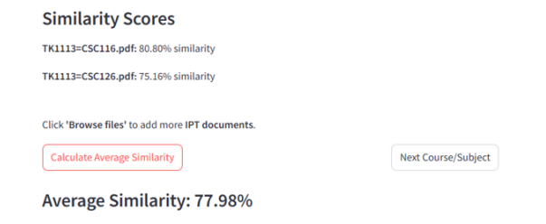

# Diploma Credit Transfer Similarity System
🔒 **Project Status**: Private
The source code for this project is hosted in a private repository due to institutional privacy policies at UKM. This repository serves as a technical overview and documentation of the system's capabilities and architecture.

**Project Description**

The Credit Transfer Similarity System is an intelligent solution designed to automate the evaluation of course equivalency between diploma and bachelor's programs. Using deep learning and OCR (Optical Character Recognition), this system analyzes course documents, compares learning outcomes, and calculates similarity scores to assist program heads in making informed credit transfer decisions.

**Features**
- Upload course documents (PDF, Word) for analysis
- Automatically extract learning outcomes using OCR
- Compare course content using similarity metrics (Jaccard, Cosine)
- Generate similarity scores and matching reports
- Interactive dashboard for program heads to review results
- Streamlines and accelerates the credit transfer process

**Tech Stack**
- Programming Languages: Python, Flutter (for dashboard interface)
- OCR Tools: Tesseract, Azure (optional)
- Deep Learning / AI: Similarity learning models (Jaccard & Cosine)
- Database & Cloud: AWS IoT / Cloud storage
- Visualization: Flutter dashboard, interactive charts

**Learning Outcomes**
- Developed expertise in OCR for document extraction
- Implemented similarity learning models (Jaccard & Cosine)
- Built interactive dashboards for data visualization
- Gained experience in automating educational evaluation processes

**Poster & System Interface**
| Poster |
| :---: |
|  |

| Dashboard & Upload | Similarity Analysis |
| :---: | :---: |
|  |  |
| *Dashboard of the system, Diploma Credit Transfer Similarity Checker* | *Jaccard & Cosine score calculation* |
